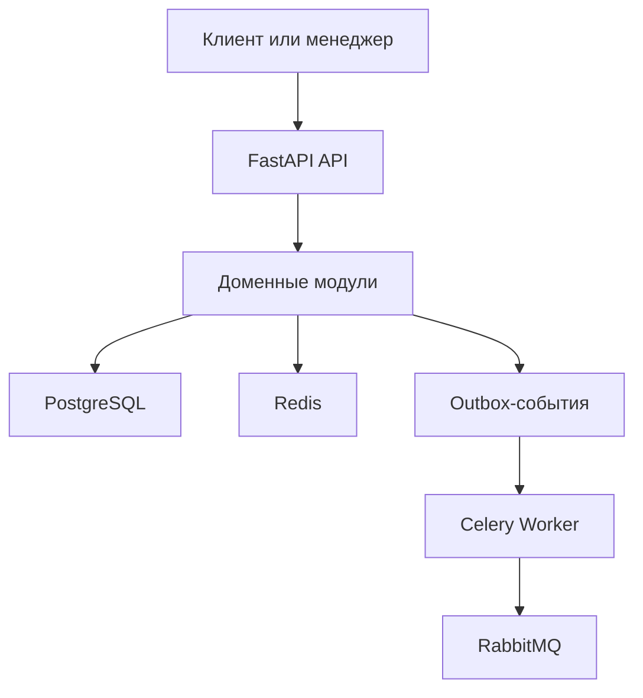

# OrderFlow

[](https://github.com/sqoapwish/orderflow/actions/workflows/ci.yml)

OrderFlow — backend-система управления заказами, оплатами и складскими остатками интернет-магазина. Проект развивается как модульный монолит уровня strong Junior+ с отдельными инженерными решениями уровня Middle: конкурентным резервированием товара, идемпотентностью, подписанными webhooks, Transactional Outbox, аудитом и наблюдаемостью.

> Текущий статус: завершены инженерная основа и модуль аутентификации. Следующий бизнес-этап — каталог. Возможности не отмечаются готовыми до реализации и тестирования.

## Что уже работает

- FastAPI с версионированием `/api/v1` и OpenAPI/Swagger;
- регистрация, вход, выход и получение текущего пользователя;
- access/refresh JWT, серверные сессии, ротация refresh-токенов и защита от их повторного использования;
- роли `customer`, `manager`, `admin` и переиспользуемая проверка прав;
- Argon2id-хэширование паролей без хранения открытых паролей или refresh-токенов;
- асинхронная инфраструктура PostgreSQL, Redis и RabbitMQ;
- Celery worker с безопасными настройками доставки задач;
- Alembic и первая миграционная граница;
- liveness- и readiness-проверки;
- структурированные JSON-логи и сквозной `X-Correlation-ID`;
- единый JSON-формат HTTP-ошибок;
- Docker Compose с health checks и отдельной тестовой БД;
- Ruff, mypy, Pytest и integration-тест инфраструктуры;
- GitHub Actions: качество, тесты, миграции, Docker build и поиск секретов;
- Dependabot для Python, GitHub Actions и Docker-образов.

## Планируемые бизнес-возможности

- каталог, категории, поиск, фильтрация и пагинация;
- несколько складов, движения остатков и конкурентные резервы;
- корзина и транзакционное оформление заказа с `Idempotency-Key`;
- Mock Payment Provider, HMAC-webhooks, возвраты и защита от дублей;
- строгий конечный автомат статусов заказа;
- Transactional Outbox, retries и dead-letter обработка;
- аудит, аналитика, метрики и минимальный демонстрационный интерфейс.

## Архитектура

Основное приложение — модульный монолит. Модули разворачиваются вместе, но бизнес-правила и работа с данными разделены по предметным областям.



Подробности и принятые решения: [документация архитектуры](docs/architecture.md) и [ADR](docs/adr/0001-modular-monolith.md).

## Стек

| Область | Технологии |
|---|---|
| API | Python 3.12, FastAPI, Pydantic, PyJWT |
| Данные | PostgreSQL 17, SQLAlchemy 2 async, asyncpg, Alembic |
| Безопасность | Argon2id, access/refresh JWT, серверные сессии и RBAC |
| Кэш и очередь | Redis 8, RabbitMQ 4, Celery 5 |
| Качество | Ruff, mypy strict, Pytest, pytest-asyncio |
| Инфраструктура | Docker, Docker Compose, GitHub Actions, uv |
| Диагностика | JSON-логи, Correlation ID, health checks |

Точные совместимые версии всех Python-зависимостей зафиксированы в `uv.lock`.

## Быстрый запуск через Docker

Требования: Docker Desktop с Docker Compose.

PowerShell:

```powershell
Copy-Item .env.example .env
docker compose up --build -d
docker compose ps
```

После запуска:

- Swagger: <http://localhost:8002/docs>
- liveness: <http://localhost:8002/api/v1/health/live>
- readiness: <http://localhost:8002/api/v1/health/ready>
- RabbitMQ UI: <http://localhost:15673>
- PostgreSQL для DBeaver: `localhost:5435`

## Аутентификация

| Метод | Endpoint | Назначение |
|---|---|---|
| `POST` | `/api/v1/auth/register` | Создать пользователя с ролью `customer` и первую сессию |
| `POST` | `/api/v1/auth/login` | Проверить пароль и создать отдельную сессию |
| `POST` | `/api/v1/auth/refresh` | Однократно использовать refresh-токен и получить новую пару |
| `POST` | `/api/v1/auth/logout` | Отозвать refresh-сессию; повторный logout безопасен |
| `GET` | `/api/v1/auth/me` | Получить актуального пользователя по Bearer access-токену |

Публичная регистрация всегда создаёт только `customer`: клиент не может передать себе роль менеджера или администратора. Access-токен живёт 15 минут, refresh-сессия — 30 дней. В PostgreSQL хранится SHA-256-хэш refresh-токена, а не сам токен. При обновлении строка сессии блокируется `SELECT FOR UPDATE`; повторное использование старого токена отзывает всю сессию.

Логи и остановка:

```powershell
docker compose logs -f api worker
docker compose down
```

## Локальная разработка

Требования: Python 3.12 и [uv](https://docs.astral.sh/uv/).

```bash
uv sync --frozen
uv run uvicorn orderflow.main:app --reload --port 8002
```

Без запущенной инфраструктуры `/live` вернёт `200`, а `/ready` — `503` с состояниями компонентов. Это ожидаемое поведение: процесс жив, но ещё не готов принимать рабочую нагрузку.

## Проверки

```bash
uv run ruff format --check .
uv run ruff check .
uv run mypy src tests
uv run pytest -m "not integration"
uv run pytest --cov=orderflow --cov-report=term-missing
uv run alembic heads
```

Integration-тест требует PostgreSQL, Redis и RabbitMQ. В CI эти сервисы поднимаются автоматически.

## Миграции

```bash
uv run alembic upgrade head
uv run alembic revision --autogenerate -m "describe change"
uv run alembic check
```

`alembic check` должен выполняться при запущенной PostgreSQL и подтверждает, что изменения моделей не остались без миграции.

## Безопасность конфигурации

- `.env` и любые `.env.*` исключены из Git;
- в репозитории хранится только `.env.example` с локальными демонстрационными значениями;
- реальные ключи, пароли и токены передаются через переменные окружения или secret storage платформы;
- production-запуск отклоняется, если используется демонстрационный JWT-секрет;
- GitHub Actions проверяет историю на случайно добавленные секреты;
- перед коммитом нужно проверить `git status` и не использовать реальные данные в тестах.

## Структура

```text
src/orderflow/
├── api/             # HTTP-маршруты и версионирование
├── core/            # настройки, ошибки, логирование, Correlation ID
├── infrastructure/  # PostgreSQL, Redis, RabbitMQ и readiness
├── modules/         # изолированные бизнес-модули
├── schemas/         # общие Pydantic-схемы
└── workers/         # Celery и фоновые задачи
```

## Лицензия

Лицензия пока не выбрана. Код нельзя считать автоматически разрешённым для повторного использования.
